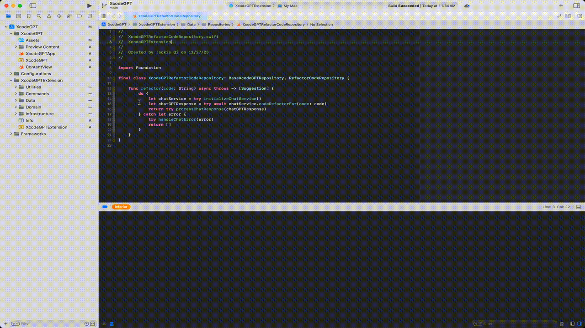

  

# ChatGPT 4 Xcode with Self-Hosted LLM

This project builds Xcode source editor extension, allows the developer to use chatGPT(openAI) or local LLM for their code.

  

## Features
* Refactor code
* Check code smells (whole file or selected lines)
* Convert json file to swift code
* Add comment to selected function
* Create regex from selected string
* Create unit test for selected function
* Explain code in the file

## Architecture
[Repository Pattern](https://medium.com/tiendeo-tech/ios-repository-pattern-in-swift-85a8c62bf436)

  

## Running OpenAI
Rename *.env.example* to *.env* and add your openAI API key (.env file is already added to .gitignore along with .xcconfig files)

**NOTE**: API key will be copied into Common.xcconfig when running the extension app with **ChatGPTExtension** scheme with a [Shell Script](Assets/Pre-actions.png) which is defined as **pre-actions** in the scheme.

## Running Self hosted language models
*You can also use your local server/LLM with following popular services. They all provide openAI compatible APIs. Just need to update two fields in *Common.xcconfig* for each of the services*
### Text Generation WebUI
[API Reference](https://github.com/oobabooga/text-generation-webui/wiki/12-%E2%80%90-OpenAI-API)

1. Enable flag *USE_TEXT_WEB_UI* 
2. Update the URL with your local server. Default: http://127.0.0.1:5000
3. Run local server `$ ./start_macos.sh --api`  (API mode)

### LM Studio
[API Reference](https://github.com/lmstudio-ai/examples/tree/main/interstitial_API#b-test-endpoints)
1. Enable flag *USE_LM_STUDIO*
2. Update the URL with your local server. Default: http://127.0.0.1:1234
3. From LLM Studio, select your model at the top, then click "**Start Server**".

## Usage
Make sure you select "**ChatGPTExtension**" [scheme](Assets/Scheme.png), then select from top menu "**Product**" -> "**Archive**". In Organizer window, select **Distribute App**, then select [**Custom**](Assets/Custom.png), [**Copy App**](Assets/Export.png). Store the app in your local folder. 

Open the folder, you should see the mac app **ChatGPT**. Double click to install. It will create extension in your mac, "**System Preference**" -> "[**Extensions**](Assets/Extension.png)". Now you should be able to use it in any xcode project under "**Editor**" -> "[**ChatGPTExtension**](Assets/Commands.png)"

**Delete Extension**: Just delete the original app from the folder where you installed before. 

## Debug & Test
Edit **ChatGPTExtension** scheme and select Xcode.app as [executable](Assets/Executable.png). When running the app, it will ask you to select a different xcode project, which will open another xcode instance. You can then use extension command directly there. Meanwhile you can see the debug info from original xcode console.

## Add new feature
1. Define your prompt in [**Localizable**](https://github.com/JackieQi/XcodeGPT/blob/main/XcodeGPTExtension/Data/Network/ChatService/Resources/Localizable.xcstrings)
2. Provide command name in [**Info.plist**](https://github.com/JackieQi/XcodeGPT/blob/main/XcodeGPTExtension/Info.plist)
3. Create your Xcode command (use case, Repository, Command) files

## TODO
- [ ] support [LiteLLM](https://github.com/BerriAI/litellm) and other popular **Self-Hosted** solutions
- [ ] support more openAI features like [OpenAISwift](https://github.com/adamrushy/OpenAISwift)

## Popular Code Models
[CodeLLama](https://huggingface.co/codellama/CodeLlama-7b-Instruct-hf)

[DeepSeeker](https://huggingface.co/TheBloke/deepseek-coder-6.7B-instruct-GGUF)

[WizardCoder](https://huggingface.co/WizardLM/WizardCoder-15B-V1.0)

[StarCoder](https://huggingface.co/TheBloke/starcoderplus-GGML)

*I used the models with 7B parameters to test which is much slower compared with openAI. Depends on your computer spec, select the one which works best for you. Suggest to use LM Studio to download the models, it will show you if the model is [compatible](Assets/Model_compatibility.png) with your machine or not.*

## Popular Self-hosted Library/Client
[llama.cpp](https://github.com/ggerganov/llama.cpp) The source project for GGUF. Offers a CLI and a server option.

[KoboldCpp](https://github.com/LostRuins/koboldcpp) a fully featured web UI, with GPU accel across all platforms and GPU architectures. Especially good for story telling.

[LoLLMS Web UI](https://github.com/ParisNeo/lollms-webui) a great web UI with many interesting and unique features, including a full model library for easy model selection.

[Faraday.dev](https://faraday.dev/) an attractive and easy to use character-based chat GUI for Windows and macOS (both Silicon and Intel), with GPU acceleration.

[ctransformers](https://github.com/marella/ctransformers) a Python library with GPU accel, LangChain support, and OpenAI-compatible AI server.

[llama-cpp-python](https://github.com/abetlen/llama-cpp-python) a Python library with GPU accel, LangChain support, and OpenAI-compatible API server.

## Reference
[Inspiration](https://medium.com/globant/chatgpt-integration-in-xcode-how-to-improve-your-apps-with-ai-3bdbc34bea48)

[Test](https://developer.apple.com/documentation/xcodekit/testing_your_source_editor_extension)

[Tips](https://nshipster.com/xcode-source-extensions/)

[Local LLM Guide](https://bootcamp.uxdesign.cc/a-complete-guide-to-running-local-llm-models-3225e4913620)

